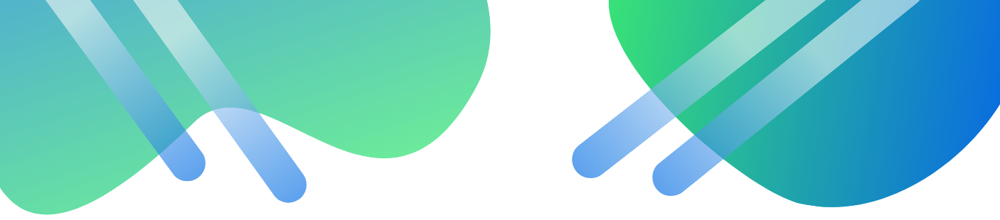
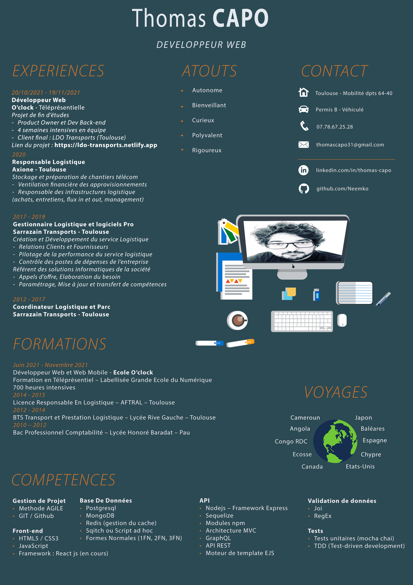
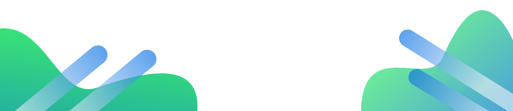

## Hi There ! :wave: I'm Thomas - aka [Neemko][linkedin]

## I'm a beginner web developer from France

- :recycle: I retrained as web developer in 2021, thanks to the [O'clock school][O'clock].  
I followed a fullstack Javascript course in which I have learned HTML, CSS, Javascript, React / Redux (in progress), Node.js with the Express framework and database (SQL/NOSQL).
- :shinto_shrine: End-of-study Project (team of 5 people) :
    - [Project Repository][LDOrepo]
    - [Web Site - LDO][LDOwebsite]
    - [YouTube presentation as Product Owner (start at 58:11)][LDOyoutube]
- :books: I’m currently learning React.js
- :thought_balloon: I would like to learn new back-end languages (C#, Java, Php) in the years ahead
- :zap: Fun fact : I'm a Murloc fan...'mrglwglwlg!' :joy:

 

---

## 	:hammer_and_wrench: Languages and Tools :

### Front-end Skills :

   

### Back-end Skills :

 

   

### Tools :

 

---

## :desktop_computer: Connect with me: 

[][twitter]
[][linkedin]

 

    
<b>My Resume<b/>

 

  
<b> :electron: Github Stats<b/>

 
  

[visitors]: https://visitor-badge.glitch.me/badge?page_id=Neemko.Neemko
[linkedin]: https://www.linkedin.com/in/thomas-capo/
[twitter]: https://twitter.com/Neemko1
[O'clock]: https://oclock.io/formations/developpeur-web-fullstack-javascript
[LDOrepo]: https://github.com/Neemko/ldo-transports-fullstackProject
[LDOwebsite]: https://ldo-transports.netlify.app
[LDOyoutube]: https://www.youtube.com/watch?v=2S5FSWNPA5g

